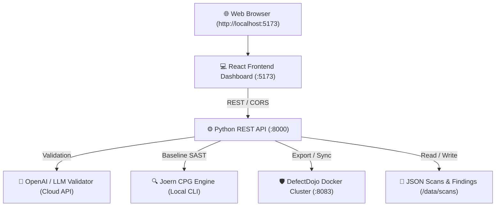

# 🚀 SAST Engine — Complete Infrastructure & Run Guide

This guide provides the complete infrastructure breakdown and step-by-step terminal commands to run the **Multi-Stage Agentic SAST Engine** standalone (without needing an AI agent).

---

## 🏗️ 1. System Architecture & Infrastructure

The application runs as 3 cooperating services alongside underlying analysis engines:



### 📋 Port & Service Breakdown

| Component | Port / URL | Tech Stack | Role |
| :--- | :---: | :--- | :--- |
| **Frontend UI** | `http://localhost:5173` | React 18 + Vite | Interactive dashboard, findings triage, visual taint path graphs |
| **Backend API** | `http://127.0.0.1:8000` | Python `http.server` | Analysis pipeline, LLM triage agent, Joern runner, REST endpoints |
| **DefectDojo** | `http://localhost:8083` | Docker Compose (Django/Postgres/Nginx) | Enterprise vulnerability management & findings sync |
| **Joern CPG** | Local CLI | Scala / CPG Engine | Code Property Graph AST + taint analysis baseline comparison |
| **LLM Validator** | External HTTPS | OpenAI `gpt-4o-mini` | Stage 3 Exploitability Judge & False Positive suppressor |

---

## ⚙️ 2. Configuration (`.env.local`)

All local environment variables and credentials reside in `.env.local` in the project root:

```env
# DefectDojo Connection
DEFECTDOJO_URL=http://localhost:8083
DEFECTDOJO_TOKEN=16d7821e440e9434371b043a40dbaa7e2f96fa5f
DEFECTDOJO_USER=admin
DEFECTDOJO_PASSWORD=SastEngine2026!
DEFECTDOJO_DIR=C:\Users\sunil\django-DefectDojo

# Joern CLI Path
JOERN_HOME=C:\Users\sunil\joern-cli

# LLM Validator
OPENAI_API_KEY=your-openai-api-key-here
LLM_PROVIDER=openai
OPENAI_MODEL=gpt-4o-mini
```

---

## 🚀 3. How to Start the App

### Option A: One-Command Startup (Recommended)

Open **PowerShell** in `c:\Users\sunil\Downloads\sast-engine\sast-engine`:

```powershell
# 1. Start all 3 services automatically
.\services.ps1 start

# 2. Check health and connectivity
.\services.ps1 status

# 3. Stop all services when done
.\services.ps1 stop

# 4. Restart services
.\services.ps1 restart
```

---

### Option B: Run in 3 Separate Terminals

If you want to view live logs for each individual service:

#### 🖥️ Terminal 1 — Python Backend API
```powershell
cd c:\Users\sunil\Downloads\sast-engine\sast-engine
.\.venv\Scripts\Activate.ps1
python server.py
```
> Expected Output: `SAST engine API on http://127.0.0.1:8000`

#### 🖥️ Terminal 2 — Frontend React Dashboard
```powershell
cd c:\Users\sunil\Downloads\sast-engine\sast-engine\ui
npm run dev
```
> Expected Output: `Local: http://localhost:5173/`

#### 🖥️ Terminal 3 — DefectDojo Docker Containers
```powershell
# Ensure Docker Desktop is running
cd C:\Users\sunil\django-DefectDojo
docker compose up -d
```
> Expected Output: `Started django-defectdojo-nginx-1`, `uwsgi-1`, `postgres-1`, etc.

---

## 🔍 4. How to Run Scans

### Method 1: Interactive Web Dashboard
1. Open [http://localhost:5173](http://localhost:5173) in your browser.
2. Select a target:
   - Quick targets: `testdata/vuln-flask`, `testdata/vuln-express`, or `testdata/safe-app`.
   - Custom code: Click **Upload Project File / Zip**.
3. Choose Engine: `builtin (fast)` or `joern (code property graph)`.
4. Toggle options (e.g. `compare against Joern baseline` or `push to DefectDojo`).
5. Click **Scan**.

### Method 2: CLI Command Line
In PowerShell:
```powershell
# Standard fast scan
python scan.py testdata/vuln-flask

# Scan and push directly into DefectDojo
python scan.py testdata/vuln-flask --push

# Scan with Joern CPG baseline comparison
python scan.py testdata/vuln-flask --engine joern

# Scan without LLM API calls (uses deterministic rule validator)
python scan.py testdata/vuln-flask --no-llm

# View suppressed false positives with reasons
python scan.py testdata/vuln-flask --show-suppressed
```

---

## 🩺 5. Health Check Endpoints

Verify all components via PowerShell:
```powershell
# Check Engine & API Health
Invoke-RestMethod -Uri http://127.0.0.1:8000/api/health | ConvertTo-Json -Depth 3

# Check DefectDojo Auth & Connectivity
Invoke-RestMethod -Uri http://127.0.0.1:8000/api/defectdojo | ConvertTo-Json -Depth 2
```

---

## 🛠️ 6. Troubleshooting Runbook

| Problem | Root Cause | Solution |
| :--- | :--- | :--- |
| **"127.0.0.1 refused to connect"** | Backend process was not started | Run `.\services.ps1 restart` or run `python server.py`. Access the UI at `http://localhost:5173`. |
| **DefectDojo "not connected"** | Docker containers stopped | Ensure Docker Desktop is running, then run `cd C:\Users\sunil\django-DefectDojo; docker compose up -d`. |
| **"validator: offline (openai did not answer)"** | OpenAI API key hit a 429 quota/rate limit | The engine automatically falls back to rule-based offline validation to keep scans working. Add credits to your OpenAI account or update the key in `.env.local`. |
| **Port 8000 or 5173 busy** | Previous process still bound to port | Run `.\services.ps1 stop` to terminate lingering processes. |
